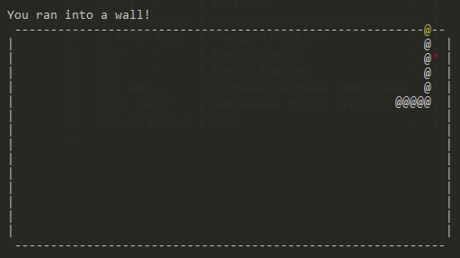

# Snek



## Installation

```
$ go get github.com/Shamus03/snek
$ snek
```

## Controls

| Key         | Behavior                        |
| ----------- | ------------------------------- |
| Arrow keys  | Change direction                |
| P           | Pause/unpause                   |
| L           | Toggle looping                  |
| + and -     | Increase/decrease game speed    |
| \* and /    | Add/remove fruits from the game |
| Ctrl-R      | Reset the game                  |
| Q or Ctrl-C | Quit                            |
